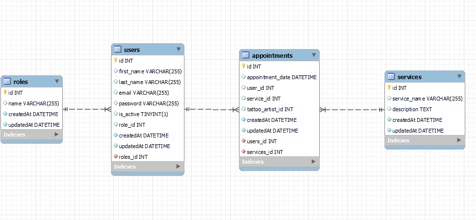

# API REST para Gestión de citas en un estudio de tatuajes


## Descripción

El proyecto consiste en desarrollar una API RESTful para la gestión citas en un estudio de tatuajes. La API permitirá a los usuarios realizar operaciones como crear, listar, actualizar y eliminar servicios, gestionar usuarios y citas.

## Contenido 🗂️

- [Stack 🛠️](#stack)
- [Caracteristicas](#features)
- [Endpoints](#enpoints)
- [Base de datos](#database)
- [Instalación](#instalacion)
- [Ejecución](#ejecucion)
- [Autora](#autora)

## <a id="stack">Stack</a>
- ORM: **Sequelize**.
- Lenguaje:  **JavaScript**.
- Framework:  **Express**.

## <a id="features">Caracteristicas</a>

- Registro y Login de Usuarios
- Gestión de Usuarios
- Gestión de Servicios
- Gestión de Citas

## <a id="enpoints">Endpoints</a>

### Autenticación

| Método | URI                           | Acción                 |
|--------|-------------------------------|------------------------|
| POST   | `/api/auth/register`          | Registro de usuarios   |
| POST   | `/api/auth/login`             | Login de usuarios      |

### Usuarios

| Método | URI                                    | Acción                       | Rol         |
|--------|----------------------------------------|------------------------------|-------------|
| GET    | `/api/users`                           | Ver todos los usuarios       | Super Admin |
| GET    | `/api/users/profile`                   | Ver perfil de usuario        |             |
| PUT    | `/api/users/profile`                   | Modificar datos del perfil   |             |
| GET    | `/api/users?email=ejemplo@ejemplo.com` | Filtrar usuario por email    | Super Admin |
| DELETE | `/api/users/:id`                       | Eliminar usuario             | Super Admin |
| PUT    | `/api/users/:id/role`                  | Cambio de role               | Super Admin |
| GET    | `/api/users/tattoo_artist`             | Listara Todos los tatuadores |             |


### Citas

| Método | URI                     | Acción                | Rol  |
|--------|-------------------------|-----------------------|------|
| POST   | `/api/appointments`     | Crear cita            |      |
| PUT    | `/api/appointments`     | Actualizar mi cita    |      |
| GET    | `/api/appointments/:id` | Recuperar cita        |      |
| GET    | `/api/appointments`     | Ver mis propias citas |      |


### Servicios

| Método | URI                 | Acción                | Rol         |
|--------|---------------------|-----------------------|-------------|
| GET    | `/api/services`     | Ver mis propias citas |             |
| POST   | `/api/services`     | Crear servicio        | Super Admin |
| PUT    | `/api/services/:id` | Actualizar servicio   | Super Admin |
| DELETE | `/api/services/:id` | Eliminar servicio     | Super Admin |

## <a id="database">Base de Datos</a>


## <a id="instalacion">Instalación </a>

Para poder usar este proyecto sigue los siguientes pasos:
- Abre tu terminal o línea de comandos y ejecuta el siguiente comando para clonar el repositorio desde GitHub
```sh
    git clone https://github.com/NeylaP/Tattoos.git
```
- Una vez clonado el repositorio, accede al directorio del proyecto.
- Abre la carpeta del proyecto en tu editor de texto o IDE favorito y abre la terminal
- Ejecuta el siguiente comando para instalar el proyecto y todos los paquetes requeridos.
```sh
    npm install
```

## <a id="ejecucion">Ejecución </a>
- Crear un archivo .env y copiar lo que esta en .env.example, pero en base a la informacion de su instancia local de base datos. 
- Colocar las credenciales y nombre de la base de datos en el archivo config.
- Crear Base de datos
- Ejecutar migraciones
```sh
    npm run migrate
```
- Ejecutar Seeders
```sh
    npm run seed
```
- Ejecutar Proyecto
```sh
    npm run dev
```
- Ahora en Postman podras consultar cada uno de los endpoints.
## <a id="autora">Autora</a>

- **Neyla Peña M.** - Developer
  - [GitHub](https://github.com/NeylaP) - [LinkedIn](https://www.linkedin.com/in/neyla-pm/) 


